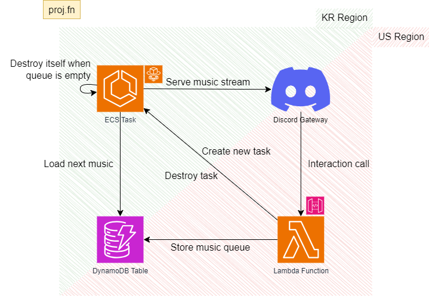

# proj.fn
Lightweight Discord music streaming infra & application\
powered by AWS serverless services (w. cross region)

## brief structure

## core components
* `/container` : container image for ecs tasks
* `/function` : serverless codes for Lambda function
* `/terraform` : Terraform manifests for basic infrastructure

## copyright notice.
&copy; 2023 Minhyeok Park

MIT Licensed. See [LICENSE file](LICENSE) for more information
